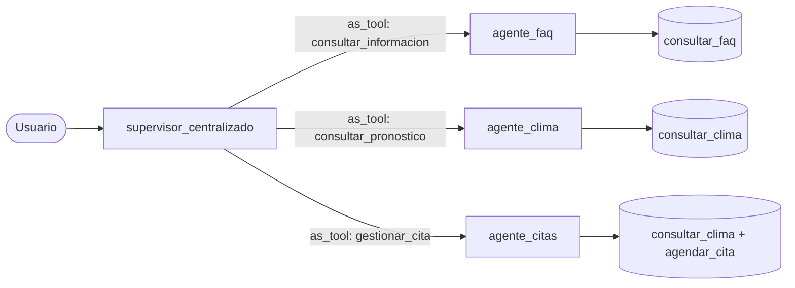
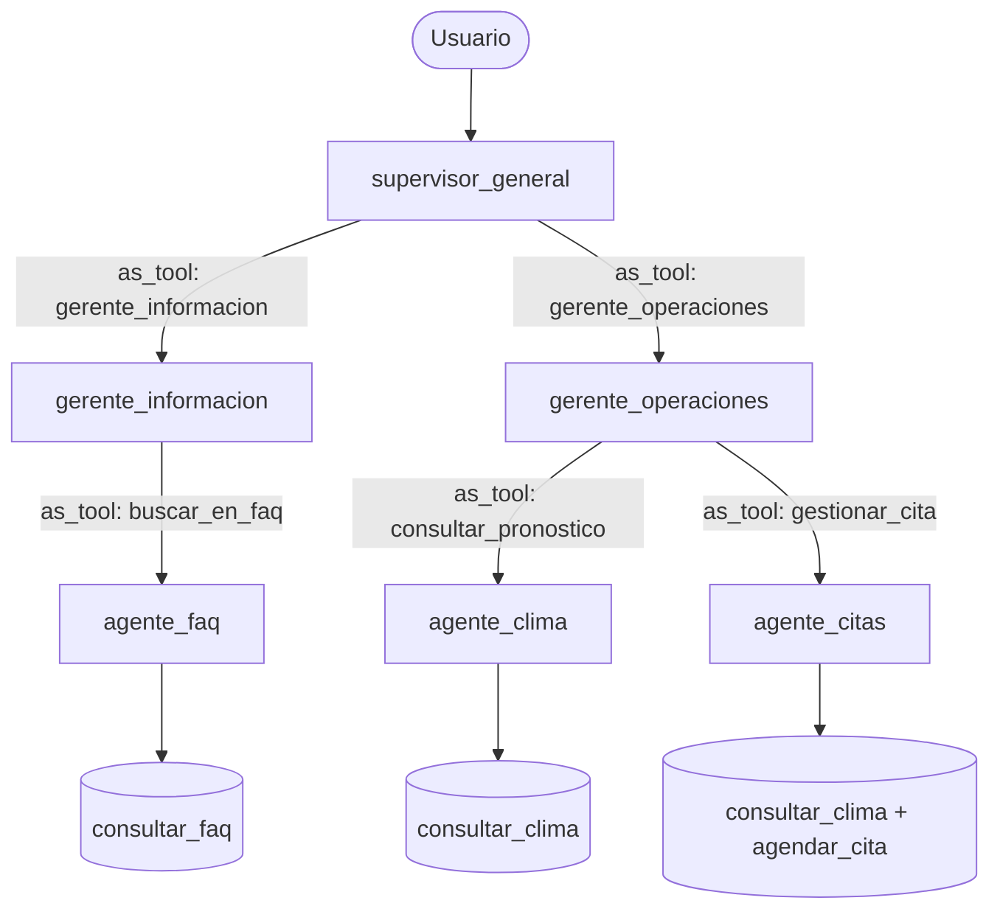
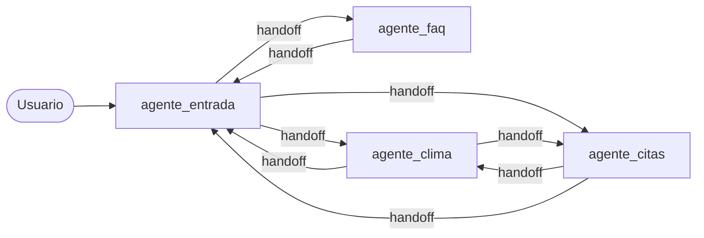
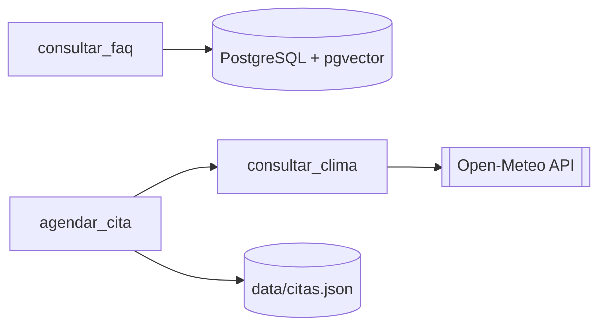

# Organización de agentes por arquitectura

Los tres programas usan los mismos especialistas (`agente_faq`, `agente_clima`, `agente_citas`)
y las mismas herramientas (`herramientas/tools.py`). Sólo cambia cómo se conectan.

## 1. Centralizada (`centralizada.py`)

Un supervisor llama a los especialistas como herramientas (`as_tool()`).

## 2. Jerárquica (`jerarquica.py`)

Un supervisor general delega en dos gerentes; cada gerente controla a sus especialistas (`as_tool()` en cada nivel).

## 3. Descentralizada (`descentralizada.py`)

No hay supervisor. Cada agente transfiere la conversación a otro con `handoff`.

## Integraciones compartidas

Las tres arquitecturas usan las mismas funciones de `herramientas/integraciones.py`. Para añadir un requerimiento
nuevo basta con crear una herramienta en `herramientas/tools.py` y asignarla a un especialista.
